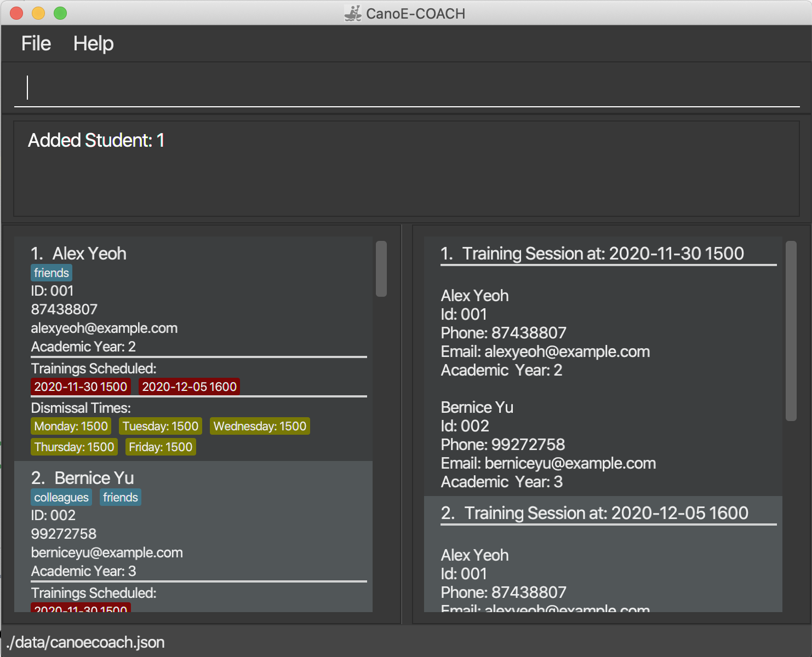

# CanoE-COACH

CanoE-COACH is a **desktop app for managing training schedules for secondary school canoe teams, optimized for use
 via a Command Line Interface** (CLI) while still having the benefits of a Graphical Interface (GUI). If you can type fast, CanoE-COACH can get your training scheduling done faster than traditional GUI apps.

--------------------------------------------------------------------------------------------------------------------

CanoE-COACH aims to help secondary school canoe coaches with managing student contacts and scheduling training sessions.

Some of the features include:
- Adding student records to the student contact list
- Finding specific students to access their records
- Filtering students by their dismissal times to find a suitable timing to schedule a training session
- Ability to tag students to include any extra information such as their level of competency and so on

For more in-depth information on the CanoE-COACH visit [our website](https://ay2021s1-cs2103-f10-1.github.io/tp/).

1. Copy the file to the folder you want to use as the _home folder_ for your CanoE-COACH.

1. Double-click the file to start the app. The GUI similar to the below should appear in a few seconds. Note how the app contains some sample data.

1. Type the command in the command box and press Enter to execute it. e.g. typing **`help`** and pressing Enter will open the help window. 
   Some example commands you can try:

   * **`add`**`n/John Doe p/98765432 e/johnd@example.com ay/2` : Adds a student named
    `John Doe` to the student list.

   * **`delete`**`3` : Deletes the 3rd student shown in the current student list.

   * **`find`**`n/alex n/david` : Returns `Alex Yeoh`, `David Li`.

   * **`clear`** : Deletes all students.

   * **`exit`** : Exits the app.

1. Refer to the [User Guide](https://ay2021s1-cs2103-f10-1.github.io/tp/UserGuide.html) for details of each command.

--------------------------------------------------------------------------------------------------------------------

This project is based on the AddressBook-Level3 project created by the [SE-EDU initiative](https://se-education.org/).
