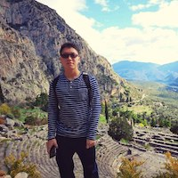

# About Us

We are a team based in the [School of Computing, National University of Singapore](http://www.comp.nus.edu.sg).

You can reach us at the email `seer[at]comp.nus.edu.sg`

## Project team

### Faqih

[[github](https://github.com/abdurrahmanfaqihiskandar)][[portfolio](team/johndoe.md)]

* Role: Team Lead

### Ye Jia Dong

[[github](https://github.com/yejiadong)][[portfolio](team/johndoe.md)]

* Role: Developer
* Responsibilities: Testing, Documentation

### Lee Wei Heng

[[github](https://github.com/Whleee)][[portfolio](team/johndoe.md)]

* Role: Developer
* Responsibilities: Testing, Documentation

### Kerk Pei Yong

[[github](https://github.com/kerkpy)][[portfolio](team/johndoe.md)]

* Role: Developer
* Responsibilities: Testing, Documentation

### Andy Wu

[[github](https://github.com/sudogene)][[portfolio](team/johndoe.md)]

* Role: Developer
* Responsibilities: Testing, Documentation
