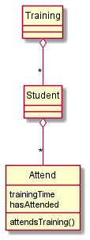
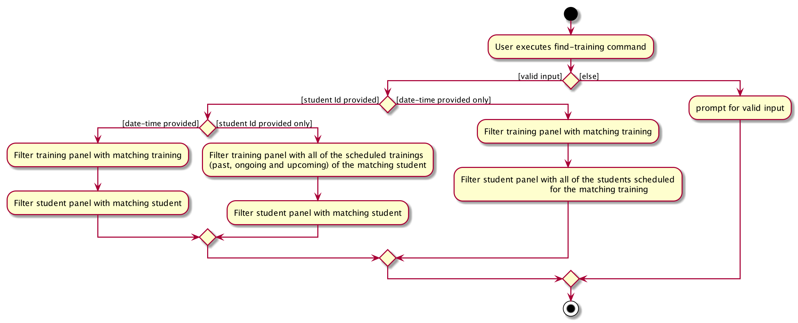

* Table of Contents
{:toc}

--------------------------------------------------------------------------------------------------------------------

## **Setting up, getting started**

Refer to the guide [_Setting up and getting started_](SettingUp.md).

--------------------------------------------------------------------------------------------------------------------

## **Design**

### Architecture

The ***Architecture Diagram*** given above explains the high-level design of the App. Given below is a quick overview of each component.

:bulb: **Tip:** The `.puml` files used to create diagrams in this document can be found in the [diagrams](https://github.com/AY2021S1-CS2103-F10-1/tp/tree/master/docs/diagrams) folder.

**`Main`** has two classes called [`Main`](https://github.com/AY2021S1-CS2103-F10-1/tp/blob/master/src/main/java/seedu/canoe/Main.java) and [`MainApp`](https://github.com/AY2021S1-CS2103-F10-1/tp/blob/master/src/main/java/seedu/canoe/MainApp.java). It is responsible for,
* At app launch: Initializes the components in the correct sequence, and connects them up with each other.
* At shut down: Shuts down the components and invokes cleanup methods where necessary.

[**`Commons`**](#common-classes) represents a collection of classes used by multiple other components.

The rest of the App consists of four components.

* [**`UI`**](#ui-component): The UI of the App.
* [**`Logic`**](#logic-component): The command executor.
* [**`Model`**](#model-component): Holds the data of the App in memory.
* [**`Storage`**](#storage-component): Reads data from, and writes data to, the hard disk.

Each of the four components,

* defines its *API* in an `interface` with the same name as the Component.
* exposes its functionality using a concrete `{Component Name}Manager` class (which implements the corresponding API `interface` mentioned in the previous point.

For example, the `Logic` component (see the class diagram given below) defines its API in the `Logic.java` interface and exposes its functionality using the `LogicManager.java` class which implements the `Logic` interface.

**How the architecture components interact with each other**

The *Sequence Diagram* below shows how the components interact with each other for the scenario where the user issues the command `delete 1`.

The sections below give more details of each component.

### UI component

**API** :
[`Ui.java`](https://github.com/AY2021S1-CS2103-F10-1/tp/blob/master/src/main/java/seedu/canoe/ui/Ui.java)

The UI consists of a `MainWindow` that is made up of parts e.g.`CommandBox`, `ResultDisplay`, `StudentListPanel
`,  `TrainingListPanel`, `StatusBarFooter` etc. All these, including the `MainWindow`, inherit from the abstract `UiPart` class.

The `UI` component uses JavaFx UI framework. The layout of these UI parts are defined in matching `.fxml` files that are in the `src/main/resources/view` folder. For example, the layout of the [`MainWindow`](https://https://github.com/AY2021S1-CS2103-F10-1/tp/blob/master/src/main/java/seedu/canoe/ui/MainWindow.java) is specified in [`MainWindow.fxml`](https://https://github.com/AY2021S1-CS2103-F10-1/tp/blob/master/src/main/resources/view/MainWindow.fxml)

The `UI` component,

* Executes user commands using the `Logic` component.
* Listens for changes to `Model` data so that the UI can be updated with the modified data.

### Logic component

**API** :
[`Logic.java`](https://github.com/AY2021S1-CS2103-F10-1/tp/blob/master/src/main/java/seedu/canoe/logic/Logic.java)

1. `Logic` uses the `CanoeCoachParser` class to parse the user command.
1. This results in a `Command` object which is executed by the `LogicManager`.
1. The command execution can affect the `Model` (e.g. adding a student).
1. The result of the command execution is encapsulated as a `CommandResult` object which is passed back to the `Ui`.
1. In addition, the `CommandResult` object can also instruct the `Ui` to perform certain actions, such as displaying help to the user.

Given below is the Sequence Diagram for interactions within the `Logic` component for the `execute("delete 1")` API call.

:information_source: **Note:** The lifeline for `DeleteCommandParser` should end at the destroy marker (X) but due to a limitation of PlantUML, the lifeline reaches the end of diagram.

### Model component

**API** : [`Model.java`](https://github.com/AY2021S1-CS2103-F10-1/tp/blob/master/src/main/java/seedu/canoe/model/Model.java)

The `Model`,

* stores a `UserPref` object that represents the user’s preferences.
* stores the CanoeCoach data.
* exposes an unmodifiable `ObservableList<Student>`  and `ObservableList<Training>` that can be 'observed' e.g. the UI can be bound to this list so that
 the UI automatically updates when the data in the list change.
* does not depend on any of the other three components.

:information_source: **Note:** An alternative (arguably, a more OOP
) model is given below. It has a `Tag` list in the `CanoeCoach`, which `Student` references. This allows `CanoeCoach` to
 only require one `Tag` object per unique `Tag`, instead of each `Student` needing their own `Tag` object. At the same time, each student contains references to 5 day objects, each storing the dismissal time of Monday, Tuesday, Wednesday, Thursday and Friday.  

### Storage component

**API** : [`Storage.java`](https://github.com/AY2021S1-CS2103-F10-1/tp/blob/master/src/main/java/seedu/canoe/storage/Storage.java)

The `Storage` component,
* can save `UserPref` objects in json format and read it back.
* can save the CanoeCoach data in json format and read it back.

### Common classes

Classes used by multiple components are in the `seedu.canoe.commons` package.

--------------------------------------------------------------------------------------------------------------------
## **Implementation**

This section describes some noteworthy details on how certain features are implemented.

### AnyMatchPredicateList / AllMatchPredicateList

### AnyMatchPredicateList

### Implementation

The `AnyMatchPredicateList` class implements the `Predicate` interface provided by the Java util library.

The `AnyMatchPredicateList` class has only one field which is a list of predicates passed to it when the constructor is called.

The list of predicates can consist of any predicate relating to a field inside of the `Student` class.

The `AnyMatchPredicateList` class has a `AnyMatchPredicateList#test()` method with a `Student` object as a parameter. This method will return true if the passed `Student` matches any of the predicates in the predicate list.

The usage of the `AnyMatchPredicateList` class is for filtering of the `Student` `ObservableList` inside of the `Model` interface.

Below is a sequence diagram of the execution of `CommonTimeCommand` which uses the `AnyMatchPredicateList` class to filter students:

In the diagram above, the `CommonTimeCommandParser` will parse the arguments and add any necessary `Predicates` into the `AnyMatchPredicateList` which is passed as an argument during the creation of the `CommonTimeCommand`.

This `AnyMatchPredicateList` is then used to filter the student list in the method `Model#updateFilteredStudentList()` which takes in the predicate list as an argument.

### AllMatchPredicateList

The `AllMatchPredicateList` has a similar implementation to the `AnyMatchPredicateList`. The only difference is that the `AllMatchPredicateList#test()` method returns true only if the passed `Student` matches **ALL** of the predicates in the predicate list.

The following class diagram shows the relationship between AnyMatchPredicateList and AllMatchPredicateList and the fields inside of the Student class:

### Training Class

#### Implementation

The Training Class represents a Training Session that Students can attend.

Training Class has 2 fields, a LocalDateTime that stores the date and time of the Training Session, and a HashSet of Students that stores the unique Students attending the Training Session.

A Training Session is initialised with no Students in the HashSet by default.

The following shows the relationship between Student, Training and Attendance.

### Find-training feature

#### Implementation

The find-training mechanism extends `Command` with the ability to view all training history (past and present) of a single student. This command is supported by methods in the `Model` interface, namely `Model#updateFilteredStudentList()`,  and`Model#updateFilteredTrainingList()`.

This command is supported by the `TrainingMatchesIdPredicate`, which assists to check if a particular student ID is present in a particular training. From the above class diagram, the `TrainingMatchesIdPredicate#test()` method is used to achieve this.

Given below is an example usage scenario and how the find-training mechanism behaves at each step.

Step 1. The user launches the application. As the student panel only displays the most recent 3 upcoming trainings scheduled, the user executes `find-training id/5` command to view all the trainings of the uniquely identified 5th student in the CanoeCoach.

:information_source: **Note:** If a command fails its execution, it will not call `Model#updateFilteredStudentList()` or `Model#updateFilteredTrainingList()`, so the GUI state will not be changed or altered.

The following sequence diagram shows how the `find-training` operation works:

:information_source: **Note:** The lifeline for `FindTrainingCommand` should end at the destroy marker (X) but due to a limitation of PlantUML, the lifeline reaches the end of diagram.

The following activity diagram summarizes what happens when a user executes a new command:

#### Design consideration:

##### Aspect: How find-training executes

* **Alternative 1 (current choice):** Filters both the student and training lists based on the student index.
  * Pros: Easy to implement.
  * Cons: Double panel filter required

* **Alternative 2:** Filters only the student list and retrieve all trainings of the student from student list to display.
  * Pros: Only one panel filter required
  * Cons: Training objects are not stored directly within the student class, hence it might be difficult to retrieve trainings

### Add Student to Training feature

### Implementation

The mechanism to add Students to Training Sessions works by taking in the user inputs of the Index of the Training Session to be edited,
as well as the Ids of the Students to be added, and adds the corresponding Students to the Training Session at the
specified index.

It extends `Command` with the overwritten `AddStudentToTrainingCommand#execute()` method
that checks a number of fields as follows before adding the Student to the Training Session:

- Whether the student can attend the Training using `Student#isAvalable(LocalDateTime dateTime)`
- Whether the student is already in the Training Session using `AddStudentToTrainingCommand#uniqueChecker(Student student)`

After all the checks have passed, the Student is then added to the Training Session and the model updated using `Model#setStudent(Student targetStudent, Student editedStudent)`,
and `Model#setTraining(Training targetTraining, Training editedTraining)`.

If any of the Students fail any of the checks, the command is discarded and the corresponding `CommandException`
will be thrown to notify the user of the error.

Given below is an example usage scenario and how the AddStudentToTrainingCommand behaves.

Step 1. The user launches the application with one training session and 1 student with Id "1".

Step 2. The user inputs `ts-add 1 id/1` and hits enter.

The following sequence diagram shows how the `ts-add` operation works:

:information_source: **Note:** If a command fails its execution, it will not call `Model#updateFilteredStudentList()` or `Model#updateFilteredTrainingList()`, so the GUI state will not be changed or altered.

The activity diagram below shows what happens when a new `ts-add` command is executed:

:information_source: **Note:** If a command fails its execution, it will not call `Model#updateFilteredStudentList()` or `Model#updateFilteredTrainingList()`, so the GUI state will not be changed or altered.

### Design Consideration:

### Aspect: How Student is added to the Training Session

* **Alternative 1:** Create a key-value pair with Student ID as the key and Student object as the value.
    * Pros : Eliminates the possibility of repeat students as each Student object only corresponds to one Student ID.
    * Cons : Need to create a new Class containing the key-value pair and refactor both Training and Student.
            Also makes the code base more complicated.

* **Alternative 2: (current choice)** Within the AddStudentToTrainingCommand implement checks to make sure that
the student to be added is not a duplicate.
    * Pros : This  is easier to implement than the key-value pair approach.
    * Cons : Checks have to be done carefully in during Command execution to prevent duplicates or bugs.

### Add all students to training feature

#### Implementation

The feature to add all students to a training extends `Command` which allows users to add all valid students, displayed on the current student list,
to a specified training. This command is supported by methods in the `Model` interface, namely `Model#getFilteredStudentList()` and `Model#getFilteredTrainingList()`.

A student is valid if they can make it for the training and if they are not already in that training. Specifically,
* The student's dismissal time is equal to or before the training's start time for the particular date
* The student does not already have a training scheduled at that date time
* The training does not already have the student added

These checks in the command are supported by `Student#isAvailableAtDateTime`, `Student#hasTrainingAtDateTime`, and `Training#hasStudent`.
Students who are added to the training will have their training schedule updated to reflect this addition, and the training will also
be updated to contain the added student.

Given below is an example usage scenario and how the command's mechanism behaves at each step.
It is assumed that there is an existing training and students in their respective lists.

Step 1. The user launches the application, then the user executes `ts-addall 1` to add all students, currently displayed, to the training at index 1.

:information_source: **Note:** If a command fails its execution, nothing will be changed or altered.

The following sequence diagram shows how the `ts-addall` operation works:

:information_source: **Note:** The lifeline for `AddAllStudentCommandParser` should end at the destroy marker (X) but due to a limitation of PlantUML, the lifeline reaches the end of diagram.

The following activity diagram summarizes what happens when a user executes the command:

#### Design consideration:

#### Aspect: How the command handles a list containing valid and invalid students

* **Alternative 1 (current choice):** Ignore invalid students and only add valid students.
  * Pros: Friendlier to the user since the feature is for convenient mass adding of students.
  * Cons: Hard to implement because of different handling behaviour of different students.

* **Alternative 2:** Returns failed command execution if there are invalid students in the list.
  * Pros: Easy to implement, either all students can be added or no student will be added.
  * Cons: More restrictive and less user-friendly, use case will be almost similar to `ts-add` command.

### Attendance class

#### Implementation

The Attendance class represents a Student attending a Training. A list of Attendance is stored in the Student, and represents all the trainings that the Student would be attending.

The Attendance class is initialised with the LocalDateTime of a Training. Currently, it also stores information about whether the Student had attended the Training or not. By default, the Attendance is marked as unattended.

The following shows the relationship between Student, Training and Attendance.

#### Design considerations:
#### Aspect: How to keep track of which trainings that a Student is attending

*  **Alternative 1:** Store a list of trainings that the Student is attending in the Student.
	* Pros: Easier implementation in the short run.
	* Cons: This causes cyclic-dependency and is undesirable.

* **Alternative 2 (Previous iteration):** Store a list of LocalDateTime in the Student, each representing the time of a Training that the Student is attending.
	* Pros: Relatively easy to implement
	* Cons: It is difficult to extend features related to Attendance, and it is inflexible.

* **Alternative 3:** Store a list of Attendances in a wrapper class, that could have, for example, a Hashmap that maps a Student to the list of Attendances.
	* Pros: This will lead to higher cohesion and low coupling, and increases the maintainability of the code.
	* Cons: It is more complex to implement. Much harder to display the attendance of a Student in the StudentCard in this current iteration.

* **Alternative 4 (Current iteration):**  Store a list of Attendance in the Student.
	* Pros: Difficulty of implementation is lower than Alternative 3. Able to support other functions easily compared to Alternative 2.
	* Cons: Potentially prone to bugs.

### Mark-attendance feature

#### Implementation

The mark-attendance mechanism extends `Command` with the ability to mark a student as having attended a particular training session.

This feature makes use of the `Attend` class which each student keeps track of. As stated above, by default an `Attend` object is constructed with `hasAttended = false`. This command sets `hasAttended` to equal to `true`.

The mark-attendance command takes in a `Training` index and multiple `Student` ids as input. Any error in the input format will result in the whole command being discarded and the state of the canoe coach book will remain unchanged.
A list of possible input errors are listed below:
- `Training` index is out of range -> `Training` cannot be found
- `Student` index is out of range -> `Student` cannot be found
- Empty parameters. i.e. `Training` index and/or `Student` ids not input
- `Student` does not have specified `Training` as part of its schedule

:information_source: **Note:** If a command fails its execution, it will not call `Model#updateFilteredStudentList()`, so the GUI state will not be changed or altered.

The following shows the sequence flow for the `mark-attendance` command:

:information_source: **Note:** If a command fails its execution, it will not call `Model#updateFilteredStudentList()`, so the GUI state will not be changed or altered.

The following activity diagram shows the flow of events when a user executes a `mark-attendance` command:

#### Design consideration:

##### Aspect: How a student's attendance is tracked

* **Alternative 1:** Create a variable in training with a key-value pair to track student and student's attendance.
  * Pros: Each student is paired with it's own attendance upon addition to the training.
  * Cons: A key-value pair variable makes the code more complicated than it has to be.

* **Alternative 2 (current choice):** Use of a class to store attendance of a student for a scheduled training.
  * Pros: A class is easier to maintain and access than a key-value pair. Code is simpler.
  * Cons: A new class has to be created and refactoring of the code base has to be done.

### \[Proposed\] Undo/redo feature

#### Proposed Implementation

The proposed undo/redo mechanism is facilitated by `VersionedCanoeCoach`. It extends `CanoeCoach` with an undo/redo history, stored internally as an `canoeCoachStateList` and `currentStatePointer`. Additionally, it implements the following operations:

* `VersionedCanoeCoach#commit()` — Saves the current CanoeCoach state in its history.
* `VersionedCanoeCoach#undo()` — Restores the previous CanoeCoach state from its history.
* `VersionedCanoeCoach#redo()` — Restores a previously undone CanoeCoach state from its history.

These operations are exposed in the `Model` interface as `Model#commitCanoeCoach()`, `Model#undoCanoeCoach()` and `Model#redoCanoeCoach()` respectively.

Given below is an example usage scenario and how the undo/redo mechanism behaves at each step.

Step 1. The user launches the application for the first time. The `VersionedCanoeCoach` will be initialized with the initial CanoeCoach state, and the `currentStatePointer` pointing to that single CanoeCoach state.

Step 2. The user executes `delete 5` command to delete the 5th student in the CanoeCoach. The `delete` command calls `Model#commitCanoeCoach()`, causing the modified state of the CanoeCoach after the `delete 5` command executes to be saved in the `canoeCoachStateList`, and the `currentStatePointer` is shifted to the newly inserted CanoeCoach state.

Step 3. The user executes `add n/David …​` to add a new student. The `add` command also calls `Model#commitCanoeCoach()`, causing another modified CanoeCoach state to be saved into the `canoeCoachStateList`.

:information_source: **Note:** If a command fails its execution, it will not call `Model#commitCanoeCoach()`, so the CanoeCoach state will not be saved into the `canoeCoachStateList`.

Step 4. The user now decides that adding the student was a mistake, and decides to undo that action by executing the `undo` command. The `undo` command will call `Model#undoCanoeCoach()`, which will shift the `currentStatePointer` once to the left, pointing it to the previous CanoeCoach state, and restores the CanoeCoach to that state.

:information_source: **Note:** If the `currentStatePointer` is at index 0, pointing to the initial CanoeCoach state, then there are no previous CanoeCoach states to restore. The `undo` command uses `Model#canUndoCanoeCoach()` to check if this is the case. If so, it will return an error to the user rather
than attempting to perform the undo.

The following sequence diagram shows how the undo operation works:

:information_source: **Note:** The lifeline for `UndoCommand` should end at the destroy marker (X) but due to a limitation of PlantUML, the lifeline reaches the end of diagram.

The `redo` command does the opposite — it calls `Model#redoCanoeCoach()`, which shifts the `currentStatePointer` once to the right, pointing to the previously undone state, and restores the CanoeCoach to that state.

:information_source: **Note:** If the `currentStatePointer` is at index `canoeCoachStateList.size() - 1`, pointing to the latest CanoeCoach state, then there are no undone CanoeCoach states to restore. The `redo` command uses `Model#canRedoCanoeCoach()` to check if this is the case. If so, it will return an error to the user rather than attempting to perform the redo.

Step 5. The user then decides to execute the command `list`. Commands that do not modify the CanoeCoach, such as `list`, will usually not call `Model#commitCanoeCoach()`, `Model#undoCanoeCoach()` or `Model#redoCanoeCoach()`. Thus, the `canoeCoachStateList` remains unchanged.

Step 6. The user executes `clear`, which calls `Model#commitCanoeCoach()`. Since the `currentStatePointer` is not pointing at the end of the `canoeCoachStateList`, all CanoeCoach states after the `currentStatePointer` will be purged. Reason: It no longer makes sense to redo the `add n/David …​` command. This is the behavior that most modern desktop applications follow.

The following activity diagram summarizes what happens when a user executes a new command:

#### Design consideration:

##### Aspect: How undo & redo executes

* **Alternative 1 (current choice):** Saves the entire CanoeCoach.
  * Pros: Easy to implement.
  * Cons: May have performance issues in terms of memory usage.

* **Alternative 2:** Individual command knows how to undo/redo by
  itself.
  * Pros: Will use less memory (e.g. for `delete`, just save the student being deleted).
  * Cons: We must ensure that the implementation of each individual command is correct.

--------------------------------------------------------------------------------------------------------------------

## **Documentation, logging, testing, configuration, dev-ops**

* [Documentation guide](Documentation.md)
* [Testing guide](Testing.md)
* [Logging guide](Logging.md)
* [Configuration guide](Configuration.md)
* [DevOps guide](DevOps.md)

--------------------------------------------------------------------------------------------------------------------

## **Appendix: Requirements**

### Product scope

**Target user profile**:

* Canoeing Coach for Secondary School Students
* Has a need to manage a significant number of students
* Prefer desktop apps over other types
* Can type fast
* Prefers typing to mouse interactions
* Is reasonably comfortable using CLI apps

**Value proposition**

* Manage students and canoeing training schedules faster than a typical mouse/GUI driven app
* Manage large student numbers efficiently
	* Automatically sound warnings if certain students do not attend consecutive trainings
* Fast scheduling of canoeing trainings compared to manual modes
* Data Visualisation

### User stories

Priorities: High (must have) - `* * *`, Medium (nice to have) - `* *`, Low (unlikely to have) - `*`

| Priority | As a …​                                    | I want to …​                     | So that I can…​                                                        |
| -------- | ------------------------------------------ | ------------------------------ | ---------------------------------------------------------------------- |
| `* * *`  | new user | see usage instructions         | refer to instructions when I forget how to use the App                 |
| `* * *`  | user     | create new student record entries          | store data of students in a structured way    |
| `* * *`  | user     | see the contact information of the students        | contact them easily when necessary.    |
| `* * *`  | user     | see the academic year that the students belong to      | use it as a metric to group the students for training.    |
| `* * *`  | user     | see the dismissal times of the students       |  find a common available time to have classes.           |
| `* *  `  | user     | be able to tag students        |  highlight students who may need more attention.           |
| `* * *`  | user     | delete students that have quit              | keep track of only current active students                |
| `* * *`  | user     | easily modify the details of my students          | see the most accurate updated information    |
| `* * *`  | user     | find students by their name          | easily retrieve the details of any student without having to go through the entire list |
| `* *`    | user     | find students by their Academic Year          | easily retrieve all students from a particular academic level |
| `* *`    | user     | find students by their Phone Numbers          | easily retrieve the details of a particular student by their contact details |
| `* * *`  | user     | find students by their dismissal time        | easily find students whose dismissal times are before a given dismissal time  |
| `* *`    | user     | find students by their Id             | easily retrieve the details of a particular student without having to go through the entire list  |
| `* *`    | user     | determine the earliest time to conduct training given a subgroup of students | schedule training at the earliest possible time for these students |
| `* * *`  | user     | create new Training sessions | schedule training at a given date and time |
| `* * *`  | user     | delete a Training session that was already created | make changes to the schedule |
| `* * *`  | user     | add students to a training session | view who are the students to expect for a training |
| `* * *`  | user     | delete students from a training session | remove students who are unable to come for training |
| `* * `   | user     | view the trainings that a student will be attending | determine the number of sessions he will be attending |
| `* * `   | user     | mark the student as having attended the training | determine the number of sessions he has attended |
| `* * `   | user     | view the students who have poor attendance | determine who are the students whom I need to monitor |

### Use cases

(For all use cases below, the **System** is the `CanoE-COACH` and the **Actor** is the `user`, unless specified otherwise)

**UC01: Add a student**

**MSS**

1. User requests to add a student to the student list
2. CanoE-COACH adds the student
    Use case ends.

**Extensions**

*   1a. Name, phone number, email, or academic year is missing.

    *  1a1. CanoE-COACH displays an error message.
        Use case resumes at step 1.

*   1b. Student with the same name already exists.
    *   1b1. CanoE-COACH displays an error message.
        Use case resumes at step 1.

*   1c. Details have invalid format.
    *   1c1. CanoE-COACH displays an error message.
        Use case resumes at step 1.

**UC02: Delete a student**

**MSS**

1.  User requests to list students
2.  CanoE-COACH shows a list of students
3.  User requests to delete a specific student in the list
4.  CanoE-COACH deletes the student
5.  CanoE-COACH removes the student from all the trainings he is scheduled in.
    Use case ends.

**Extensions**

* 2a. The list is empty.
  Use case ends.

* 3a. The given index is invalid.
    * 3a1. CanoE-COACH shows an error message.
      Use case resumes at step 2.

**UC03: Edit a Student's particulars**

**MSS**

1.  User requests to list students
2.  CanoE-COACH shows a list of students
3.  User requests to edit a specific student in the list
4.  CanoE-COACH edits the student's details
    Use case ends.

**Extensions**

* 2a. The list is empty.
  Use case ends.

* 3a. The given index is invalid.
    * 3a1. CanoE-COACH shows an error message.
      Use case resumes at step 2.

* 4a. The student's new dismissal time is later than a training that he has been scheduled for.
    * 4a1. Student is removed from the Training.
    Use case ends.

**UC04: Find students**

**MSS**

1.  User requests to find students
2.  CanoE-COACH shows a list of students who match the criteria
    Use case ends.

**Extensions**

* 1a. There are no parameters specified in the find command.
  * 1a1. CanoE-COACH shows an error message.
      Use case resumes at step 1.

**UC05: Clear all Students**

**MSS**

1.  User requests to clear all students
2.  CanoE-COACH deletes all existing students in the student list
    Use case ends.

**UC06: Find Common Time to conduct training for students**

**MSS**

1.  User requests to find common time to conduct training for a specified sub-group of students
2.  CanoE-COACH shows a list of students that have been specified by user.
2.  CanoE-COACH shows shows the latest dismissal times for the list of students.
    Use case ends.

**Extensions**

* 1a. There are no parameters specified in the commonTime command.
  * 1a1. CanoE-COACH shows an error message.
    Use case resumes at step 1.

**UC07: Add a Training**

**MSS**

1. User requests to add a Training to the training list.
2. CanoE-COACH adds the training.
   Use case ends.

**Extensions**

* 1a. Date or time is missing.
  * 1a1. CanoE-COACH displays an error message.
    Use case resumes at step 1.

* 1b. Training with the same date and time already exists.
   * 1b1. CanoE-COACH displays an error message.
     Use case resumes at step 1.

* 1c. The Date and Time provided is not valid.
   * 1c1. CanoE-Coach displays an error message.
     Use case resumes at step 1.

**UC08: Delete a training**

**MSS**

1.  User requests to delete a specific training in the list
2.  CanoE-COACH deletes the training
3.  CanoE-COACH removes the training from all the students that are attending the training.
    Use case ends.

**Extensions**

* 2a. The given index is invalid.
    * 2a1. CanoE-COACH shows an error message.
      Use case resumes at step 1.

**UC09: Add students to the training**

**MSS**

1.  User requests to add students to training.
2.  CanoE-COACH adds the specified students to the training.
    Use case ends.

**Extensions**

* 2a. The student's dismissal time is later than the time the training is scheduled for.
  * 2a1. CanoE-COACH shows an error message.
    Use case resumes at step 1.

* 2b. The student or training does not exist.
  * 2b1. CanoE-COACH shows an error message.
    Use case resumes at step 1.

* 2c. There are repeated student Id values.
  * 2c1. CanoE-COACH shows an error message.
    Use case resumes at step 1.

**UC10: Delete student from training**

**MSS**

1.  User requests to delete student from training.
2.  CanoE-COACH deletes the specified student from the training.
3.  CanoE-COACH deletes the training from the student's list of trainings.
    Use case ends.

**Extensions**

* 2a. Student was not attending the training
  * 2a1. CanoE-COACH shows an error message.
    Use case resumes at step 1.

* 2b. The student or training does not exist.
  * 2b1. CanoE-COACH shows an error message.
    Use case resumes at step 1.

* 2c. There are repeated student Id values.
  * 2c1. CanoE-COACH shows an error message.
    Use case resumes at step 1.

**UC11: Add all students to the training**

**MSS**

1.  User requests to add all students to training.
2.  CanoE-COACH adds all students to the training.
    Use case ends.

**Extensions**

* 2a. The student list is empty.
  * 2a1. CanoE-COACH shows an error message.
        Use case resumes at step 1.

* 2b. No student can be added to the training.
    * 2b1. CanoE-COACH shows an error message.
      Use case resumes at step 1.

**UC12: Mark student as having attended training session**

**MSS**

1.  User requests to mark student as attended a training.
2.  CanoE-COACH marks specified student as attended the specified training.
    Use case ends.

**Extensions**

* 1a. Specified training cannot be found.
  * 1a1. CanoE-COACH shows an error message.
    Use case ends.

* 2a. The student list is empty.
  * 2a1. CanoE-COACH shows an error message.
    Use case resumes at step 1.

### Non-Functional Requirements

1.  Should work on any _mainstream OS_ as long as it has Java `11` or above installed.
2.  Should be able to hold up to 1000 students without a noticeable sluggishness in performance for typical usage.
3.  A user with above average typing speed for regular English text (i.e. not code, not system admin commands) should be able to accomplish most of the tasks faster using commands than using the mouse.
4. CanoE-COACH is optimised for a single-user, rather than multiple users.
5. Any data must be stored locally in a human editable text-file, rather than in a database.
6. The system should respond to commands within 1 second.

### Glossary

* **Mainstream OS**: Windows, Linux, Unix, OS-X

--------------------------------------------------------------------------------------------------------------------

## **Appendix: Instructions for manual testing**

Given below are instructions to test the app manually.

:information_source: **Note:** These instructions only provide a starting point for testers to work on;
testers are expected to do more *exploratory* testing.

### Launch and shutdown

1. Initial launch

   1. Download the jar file and copy into an empty folder

   1. Double-click the jar file Expected: Shows the GUI with a set of sample contacts. The window size may not be optimum.

1. Saving window preferences

   1. Resize the window to an optimum size. Move the window to a different location. Close the window.

   1. Re-launch the app by double-clicking the jar file. 
       Expected: The most recent window size and location is retained.

### Deleting a student

1. Deleting a student while all students are being shown

   1. Prerequisites: List all students using the `list` command. Multiple students in the list.

   1. Test case: `delete 1` 
      Expected: First student is deleted from the list. Details of the deleted student is shown in the status message. Timestamp in the status bar is updated.

   1. Test case: `delete 0` 
      Expected: No student is deleted. Error details shown in the status message. Status bar remains the same.

   1. Other incorrect delete commands to try: `delete`, `delete x`, `...` (where x is larger than the list size) 
      Expected: Similar to previous.

### Saving data

1. Dealing with missing/corrupted data files

   1. _{explain how to simulate a missing/corrupted file, and the expected behavior}_

### Find common dismissal time among Students

1. Finding the latest dismissal times among all specified Students for all days of the week.

    1. No prerequisites need to be fulfilled.

    1. Test case: `common-time id/`  
       Expected: Empty field detected. Error details shown in the status message.

    1. Test case: `common-time ay/`  
       Expected: Same as previous.

    1. Test case: `common-time id/1,2,2,3,4`  
       Expected: Duplicate Ids detected. Error details shown in the status message.

    1. Test case: `common-time id/1,2,3,4`  
       Expected: The latest dismissal times for Students with id 1, 2, 3, and 4 are shown in the results message.

    1. Test case: `common-time ay/6`  
       Expected: Academic year does not exist. Error details shown in the status message.

    1. Test case: `common-time ay/2`  
       Expected: The latest dismissal times for Students in the academic year 2 are shown in the results message.

### Creating a new Training Session

1. Creating a new Training Session while all students are being shown.

    1. Prerequisites: List all students and trainings using the `list` command.

    1. Test case: `training 2021-10-20 1900`  
       Expected: New Training Session at date `2021-10-20` and time `1900` will be created. Date and Time of Training Session created is shown in the status message.

    1. Test case: `training 2021-20-20 1900`  
       Expected: No Training Session is created. Error details shown in the status message.

    1. Test case: `training 2021-10-20 2500`  
       Expected: Similar to previous.

    1. Test case: `training 2021-10-10`  
       Expected: Similar to previous.

    1. Test case: `training`  
       Expected: Similar to previous.

    1. Other incorrect commands to try: `training x`, where x are alphabets, or do not follow the date time formatting.

### Deleting a Training Session

1. Deleting a Training Session while all students are being shown.

    1. Prerequisites: List all students and trainings using the `list` command. There is at least one Training Session in the list.

    1. Test case: `delete-training 1`  
       Expected: The first Training Session is deleted. The details of the deleted Training shown in the status message.

    1. Test case: `delete-training -1`  
       Expected: No Training Session is created. Error details shown in the status message.

    1. Test case: `delete-training a`  
       Expected: Similar to previous.

    1. Test case: `delete-training`  
       Expected: Similar to previous.

    1. Other incorrect commands to try: `delete-training x`, where x are all non-numeric, or is a number greater than the number of Training Sessions in the Training list.

### Adding Student to Training Session

1. Adding a student while all students are being shown

    1. Prerequisites: List all students and trainings using the `list` command. Multiple students in the list. Multiple Training sessions in the list.

    1. Test case: `ts-add 1 id/1`  
       Expected: Student with the unique Id of 1 is added to the first Training Session. Id of added student and Training Session added to is shown in the status message.

    1. Test case: `ts-add 1 id/1,1,1`  
       Expected: No student is added to any Training Session. Error details shown in the status message.

    1. Test case: `ts-add -1 id/1`  
       Expected: Similar to previous.

    1. Test case: `ts-add 1 id/-1,1`  
       Expected: Similar to previous.

    1. Test case: `ts-add 1 id/`  
       Expected: Similar to previous.

    1. Test case: `ts-add 1`  
       Expected: Similar to previous.

    1. Test case: `ts-add`  
       Expected: Similar to previous.

    1. Other incorrect commands to try: `ts-add x id/y,y,y`, where x is greater than the number of Training Sessions, and y is not the Id of any Student.

### Deleting Student from Training Session

1. Deleting a student while all students are being shown

    1. Prerequisites: List all students and trainings using the `list` command. Multiple students in the list. Multiple Training sessions in the list. Training Sessions already contain Students inside.

    1. Test case: `ts-delete 1 id/1`  
       Expected: Student with the unique Id of 1 is deleted from the first Training Session. Id of deleted student and Training Session added to is shown in the status message.

    1. Test case: `ts-delete 1 id/1,1,1`  
       Expected: No student is deleted from any Training Session. Error details shown in the status message.

    1. Test case: `ts-delete -1 id/1`  
       Expected: Similar to previous.

    1. Test case: `ts-delete 1 id/-1,1`  
       Expected: Similar to previous.

    1. Test case: `ts-delete 1 id/`  
       Expected: Similar to previous.

    1. Test case: `ts-delete 1`  
       Expected: Similar to previous.

    1. Test case: `ts-delete`  
       Expected: Similar to previous.

    1. Other incorrect commands to try: `ts-delete x id/y,y,y`, where x is greater than the number of Training Sessions, and y is not the Id of any Student.

### Adding all Students to a Training Session

1. Adding all Students to a Training Session while all students are being shown.

    1. Prerequisites: List all students and trainings using the `list` command. There is at least one Training Session in the Training list, and at least 1 student in the Student List.

    1. Test case: `ts-addall 1`  
       Expected: All Students in the Student list are added to the first Training Session. Ids of added students shown in the status message.

    1. Test case: `ts-addall -1`  
       Expected: No Students are added to any Training Session. Error details shown in the status message.

    1. Test case: `ts-addall a`  
       Expected: Similar to previous.

    1. Test case: `ts-addall`  
       Expected: Similar to previous.

    1. Other incorrect commands to try: `ts-addall x`, where x are all non-numeric, or corresponds to a Training Session with all Students in the Student List already inside.
    
### Marking the Attendance of a Student

1. Marking the Attendance of a Student.

    1. Prerequisites: There is at least one Training Session in the Training list that has passed, and at least 1 student who is attending that training. In the test cases, assume that the
    student has id 1.

    1. Test case: `mark-attendance 1 id/1`  
       Expected: Student's Attendance for Training will be successfully marked.

    1. Test case: `mark-attendance 1 id/-1`  
       Expected: Invalid id. Error details shown in the status message.

    1. Test case: `mark-attendance 1 id/5`  
       Expected: Assuming that student with id 5 is not attending the training, error details shown in the status message.

    1. Test case: `mark-attendance 3 id/1`  
           Expected: Assuming that training does exist but has not passed, Attendance will not be marked. error details shown in the status message.

    1. Test case: `mark-attendance -1 id/1`  
       Expected: Invalid training index. Error details shown in the status message.

    1. Test case: `mark-attendance 1 id/1,2,3`  
       Expected: Assuming that students with id 1, 2 and 3 and all valid students, the Students' Attendances for Training will be successfully marked.

### Find all Students with a Bad Attendance Record

1. Finding all students who have missed more than three prior training sessions

    1. No prerequisites need to be fulfilled.

    1. Test case: `find-bad-students`  
       Expected: A list of Students with a bad attendance record (missed more than three prior training sessions) will be shown in the results message.
