---
layout: page
title: User Guide
---

CanoE-COACH is a **desktop app for managing training schedules for secondary school canoe teams, optimized for use via a Command Line Interface** (CLI) while still having the benefits of a Graphical Interface (GUI). If you can type fast, CanoE-COACH can get your training scheduling done faster than traditional GUI apps.

* Table of Contents
{:toc}

--------------------------------------------------------------------------------------------------------------------

## Quick start

1. Ensure you have Java `11` or above installed in your Computer.

1. Download the latest `CanoE-COACH.jar` from [here](https://github.com/AY2021S1-CS2103-F10-1/tp/releases).

1. Copy the file to the folder you want to use as the _home folder_ for your CanoE-COACH.

1. Double-click the file to start the app. The GUI similar to the below should appear in a few seconds. Note how the app contains some sample data.  

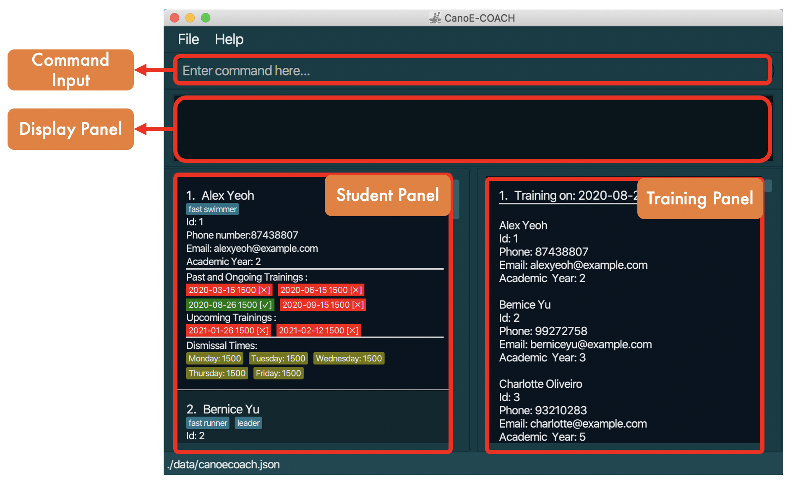

 
1. Type the command in the command box and press Enter to execute it. e.g. typing **`help`** and pressing Enter will open the help window. 
   Some example commands you can try:

   * **`list`** : Lists all students and trainings.

   * **`add`**`n/Steven Soo p/98665432 e/stev@example.com ay/2` : Adds a student named
    `Steven Soo` to the student list.

   * **`training`**`2021-08-26 1500` : Adds a training scheduled on the 26th of August, 2021, with a start time of 1500 to the training list.

   * **`delete`**`3` : Deletes the 3rd student shown in the student list.

   * **`clear`** : Deletes all students and trainings.

   * **`exit`** : Exits the app.

1. Refer to the [Features](#features) below for details of each command.

--------------------------------------------------------------------------------------------------------------------
## Features

**:information_source: Notes about the command format:** 

* Words in `UPPER_CASE` are the parameters to be supplied by the user. 
  e.g. in `add n/NAME`, `NAME` is a parameter which can be used as `add n/John Doe`.

* Items in square brackets are optional. 
  e.g `n/NAME [t/TAG]` can be used as `n/John Doe t/treasurer` or as `n/John Doe`.

* Items with `…`​ after them can be used multiple times including zero times. 
  e.g. `[t/TAG]…​` can be used as ` ` (i.e. 0 times), `t/treasurer`, `t/treasurer t/EXCO` etc.

* Parameters can be in any order. 
  e.g. if the command specifies `n/NAME p/PHONE_NUMBER`, `p/PHONE_NUMBER n/NAME` is also acceptable.

* Take note of the difference between `STUDENT_INDEX` and `STUDENT_ID`
	* `STUDENT_INDEX` refers to the index displayed on the GUI (this will change depending on how the GUI is filtered)
	* `STUDENT_ID` refers to the unique index given to each student, as reflected in the GUI by **Id: 1** (This will not change even if the GUI is filtered.)

### Viewing help: `help`
Shows a summarised list of available commands.

  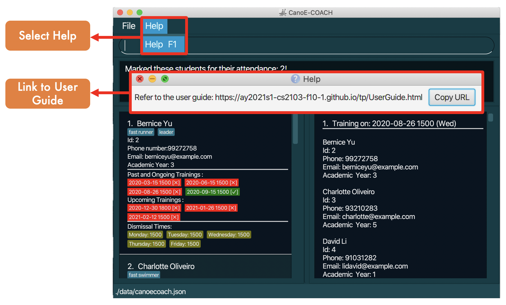

Format: `help`

### Adding a student: `add`
Adds a student to the student list. The student will be auto-assigned a unique `id`.

  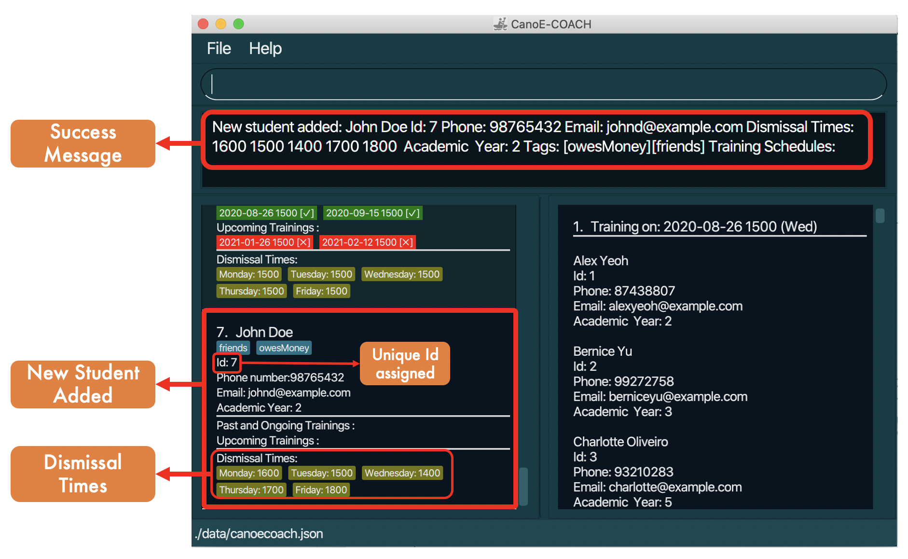

Format: `add n/NAME p/PHONE_NUMBER e/EMAIL ay/ACADEMIC_YEAR [d1/HHmm d2/HHmm d3/HHmm d4/HHmm d5/HHmm] [t/TAG]`

Prefix | Representation
----------|-------------
**d1/** | `Monday's Dismissal Time`
**d2/** | `Tuesday's Dismissal Time`
**d3/** | `Wednesday's Dismissal Time`
**d4/** | `Thursday's Dismissal Time`
**d5/** | `Friday's Dismissal Time`

* Academic year ranges from `1` to `5` and represents Secondary 1 to 5.
* `d1/ d2/ d3/ d4/ d5/` corresponds to the dismissal times on different days. They are optional fields.
* The default dismissal time is 1500. If the user inputs `d1/1700 d5/1200`, then the record will be equivalent to `d1/1700 d2/1500 d3/1500 d4/1500 d5/1200`

> Be careful of adding duplicates:
> * We allow for duplicate details in our student list, but two students should not share the same name **AND** academic year **AND** (phone number **OR** email address).

Examples:
- `add n/Benjamin p/12345678 e/littleicemaiden@rocket.com ay/3 d1/1330 d2/1730 d3/1600 d4/1200 d5/1100`
- `add n/Sarah p/56781234 e/sa.rah@googoo.com ay/1 d1/1700 d3/1430`

### Editing a student : `edit`

Edits an existing student in the student list.

  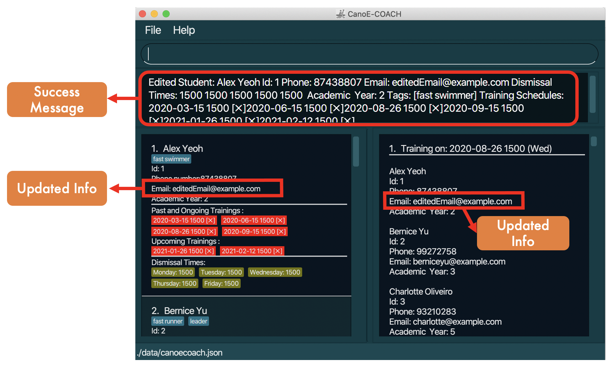

Format: `edit STUDENT_INDEX [n/NAME] [p/PHONE] [e/EMAIL] [ay/ACADEMIC_YEAR] [d1/HHmm d2/HHmm d3/HHmm d4/HHmm d5/HHmm] [t/TAG]…​`

* Edits the student at the specified `STUDENT_INDEX`. The student index refers to the index number shown in the displayed student list. The student index **must be a positive integer** 1, 2, 3, …​
* At least one of the optional fields must be provided.
* Existing values will be updated to the input values.
* When editing tags, the existing tags of the student will be removed i.e adding of tags is not cumulative.
* You can remove all of the student’s tags by typing `t/` without specifying any tags after it.
* Take note that editing the details of a student will also propagate the changes on the training panel.
* Be careful when editing dismissal times, as this might automatically remove students from scheduled trainings if the updated dismissal time on the same day of the week is now later than the start time of any of the student's upcoming scheduled trainings. Past trainings will not be affected.

Examples:
*  `edit 1 p/91234567 e/johndoe@example.com d1/1600` Edits the phone number and email address of the 1st student in the displayed student list to be `91234567` and `johndoe@example.com` respectively. This also changes his Monday's dismissal time to 1600.
*  `edit 2 n/Betsy Crower t/` Edits the name of the 2nd student to be `Betsy Crower` and clears all existing tags.

### Delete student: `delete`
Deletes the specified student from the student list.

  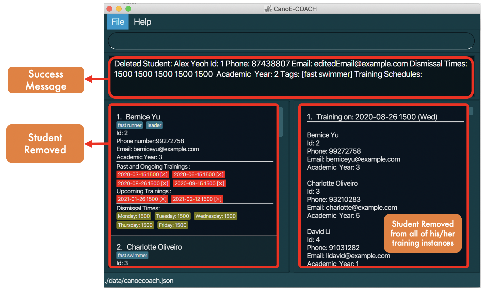

Format: `delete STUDENT_INDEX`
- Deletes the student at the specified `STUDENT_INDEX`.
- The student index refers to the index number shown in the displayed student list. (This is different from the unique ID of each student.)
- The index must be an unsigned integer 1, 2, 3, …
- This will remove the student from all of his/her scheduled training sessions (both past and present).

Examples:
- `delete 2` deletes the 2nd student in the displayed student list.

### Find : `find`
Find students based on specified fields.

  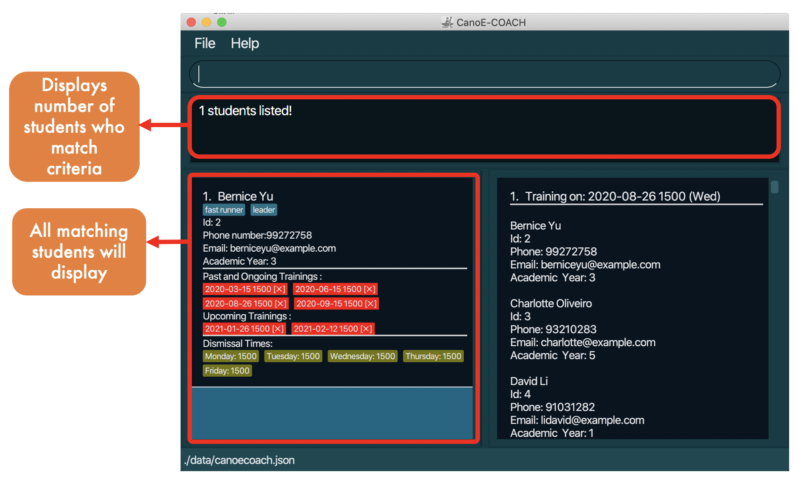

Format: `find [n/KEYWORDS] [p/PHONE_VALUE] [ay/ACADEMIC_YEAR] [e/EMAIL] [d1/HHmm d2/HHmm d3/HHmm d4/HHmm d5/HHmm] [id/STUDENT_ID]`

- At least one field needs to be filled
- Name
    - The search is case-insensitive. e.g `hans` will match `Hans`
    - The order of the keywords does not matter. e.g. `Hans Bo` will match `Bo Hans`
    - Only full words will be matched e.g. `Han` will not match `Hans`
    - Students matching at least one keyword will be returned (i.e. OR search). e.g. `Hans Bo` will return `Hans Gruber`, `Bo Yang`

- Phone Number
    - Value will match exactly. e.g. `98765432` will not match `987654` but will match `98765432`
    - The phone value query must be a valid phone number. e.g. `p/1` is invalid, `p/111` is valid
    - Only one phone number can be searched for at any one time

- Email
    - Emails containing the search word will be returned. e.g. `meow` will match `meow@domain.com`, `emailer@meow.com`
    - Only one email address can be searched for at any one time

- Academic Year
    - Value will match exactly. e.g. `2` will match `2` but not `1`
    - The academic year value query must be a valid academic year. e.g. `ay/6` is invalid, `ay/4` is valid

- Dismissal Time (`d1` to `d5`)
    - Students with dismissal times equal OR before the query time will be matched

      e.g. `d1/1500` will match `1500` and `1200`, but not `1530` on Monday

    - The dismissal time value query must be a valid dismissal time

- Id
    - Student with the same `id` value will be matched.
    - The id value query must be a valid id. e.g. `id/abc` is invalid, `id/2` is valid
    - Due to the nature of id being unique, only one student will be matched.

- **Searching by more than one field**
    - Find command will return student(s) that matches all the fields provided. e.g. `n/Alex p/123` will return `Alex Yeoh` only if his phone number matches `123`
    - Order in which fields are written does not matter. e.g. `find n/alex e/meow@gmail.com` is the same as `find e/meow@gmail.com n/alex`

Examples:
- `find n/alex david` returns `Alex Yeoh`, `David Li`
- `find n/alex david p/123` returns `Alex Yeoh` since his phone number is `123`
- `find n/Alex d2/1600` returns `Alex Yeoh`, provided his dismissal time on Tuesday falls at or before `1600`
- `find ay/1` returns all students who are of Academic Year 1
- `find id/3` returns the student with the student Id 3
- `find d4/1700` returns all students who have their Thursday dismissal time equal to or before 1700
- `find d2/1500 ay/2` returns all Academic Year 2 students with Tuesday dismissal time equal to or before 1500

### Common Time : `common-time`
Returns the latest dismissal times on each day for all of the students in the specified subgroup. This would display the earliest time possible to schedule a training for all students in the sub group.

  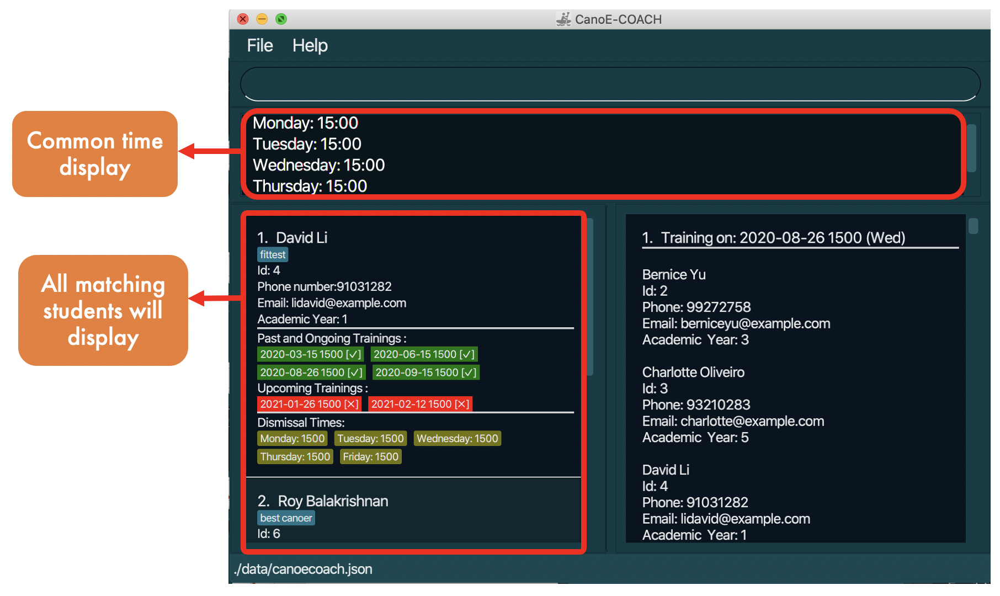

Format: `common-time [n/KEYWORDS] [ay/ACADEMIC_YEAR]`

- At least one field needs to be filled
- Name
    - The search is case-insensitive. e.g `hans` will match `Hans`
    - The order of the keywords does not matter. e.g. `Hans Bo` will match `Bo Hans`
    - Only full words will be matched e.g. `Han` will not match `Hans`
    - Students matching at least one keyword will be checked (i.e. OR search). e.g. `Hans Bo` will match `Hans Gruber`, `Bo Yang`

- Academic Year
    - Value will match exactly. e.g. `2` will match `2` but not `1`
    - The academic year value query must be a valid academic year. e.g. `ay/6` is invalid, `ay/4` is valid

- **Searching by more than one field**
    - Common Time command will return student(s) that matches any of the fields provided.

- If no student matches the search criteria, an error message will display.

Examples:
- `common-time n/alex ay/1` returns the latest dismissal times for all students with names containing the whole word `alex`, **OR** who are in Academic Year 1.
- `common-time ay/1` returns the latest dismissal times for all the students in the student list who are in Academic Year 1.
- `common-time n/Alex Jane Mary` returns the latest dismissal times for all students with names Alex, Jane or Mary. Take note the rules above for matching applies.

### Create Training : `training`
Creates a new training at the specified date and time.

  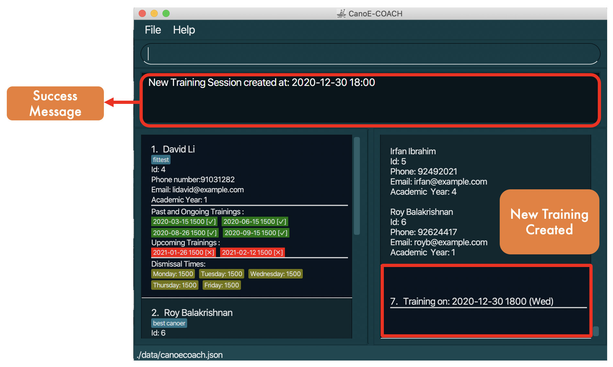

Format: `training yyyy-MM-dd HHmm`

* Take note of the format of the date and time.
* Only one date time can be specified with each command.

Examples:
- `training 2021-10-10 1500` will create a training on the 10th of October, 2021, with 1500 as the training **start time**.

### Delete Training : `delete-training`
Deletes an existing training from the training list.

Format: `delete-training TRAINING_INDEX`

* Deletes the training at the specified `TRAINING_INDEX`.
* Training index refers to the index of the training in the **displayed** training list.
* The index must be an unsigned integer 1, 2, 3, …
* All students inside of the training to be deleted will have the training removed from their training schedules.

Examples:
- `delete-training 2` removes the training with index 2 in the displayed training list.

### Add Student to Training : `ts-add`
Adds students to a training.

  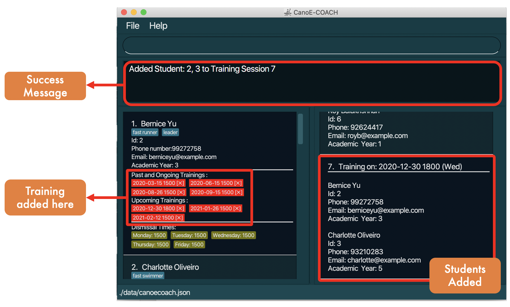

Format: `ts-add TRAINING_INDEX id/STUDENT_ID...`

* Training index refers to the index of the training in the **displayed** training list.
* Multiple students can be added with the same command by inputing multiple student indexes separated with a comma.
* Only one training index can be specified at a time.
* Each student can only be added to a **SINGLE** training on the same date regardless of time.
* Student's dismissal time for the same day should also be equal or earlier than the time of the training. (i.e. Student's dismissal time for Monday should be equal or earlier than the time of a training that falls on a Monday for him/her to be successfully added.)

> Note: Training schedules can also be viewed on the student list panel and they will update as you add students to trainings. Students will be displayed in lexicographic order in each Training Session.

Examples:
- `ts-add 2 id/1,2,3` adds students with id values 1,2,3 to training 1.

### Add All Available Students to Training : `ts-addall`
Adds all available students to a training.

Format: `ts-addall TRAINING_INDEX`

* Training index refers to the index of the training in the **displayed** training list.
* All students displayed in the student list will be added to the training if they can be added.
* A student can be added to the training if and only if:
   * They are available for the training's date time based on their dismissal times
   * They do not have an existing training at that date time
   * The training does not already contain that student
* Students that are not available will be ignored.

> Note: Training schedules can also be viewed on the student list panel and they will update as you add students to trainings.

Examples:
- `ts-addall 1` adds all available students from the displayed student list to training 1.

### Delete Student from Training : `ts-delete`
Deletes students from a training.

Format: `ts-delete TRAINING_INDEX id/STUDENT_ID...`

* Training index refers to the index of the training in the **displayed** training list.
* Multiple students can be deleted with the same command by listing multiple student Ids separated with a comma.
* Only one training index can be specified at a time.

> Note: Training schedules can also be viewed on the student list panel and it will update as you delete students from
> trainings.

Examples:
- `ts-delete 2 id/1,2,3` deletes students with id values 1,2,3 from training 2.

### Find trainings : `find-training`
Finds trainings based on specified fields.

  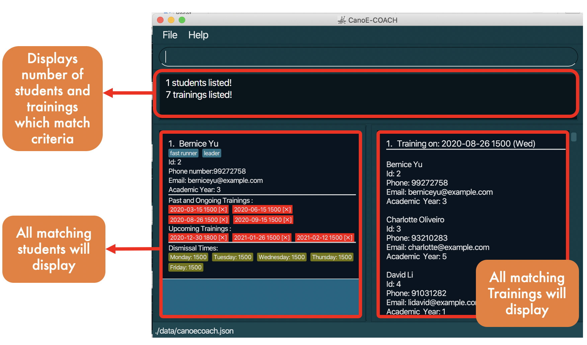

Format: `find-training [id/STUDENT_ID] [dt/DATETIME]`

* At least one field must be specified.
* Only ONE student id can be specified in the same command
* Only ONE date-time can be specified in the same command
* Date-time must be in the form `yyyy-MM-dd HHmm` (i.e. 2021-08-26 1800)
* Date-time specified will be matched with the date-time (start time) of trainings in order to return matched trainings.
* If only the student id is specified, the command will return all of the scheduled trainings (past, ongoing and upcoming) of the matching student.
* If only the date-time is specified, the command will return all of the students scheduled for that matching training on the student panel.
* If both parameters are specified, the command will return only the single matching training on the training panel and the matching student on the student panel.

Examples:
- `find-training id/1` filters the student and training panel to show only the student with id value 1 and all of his past, present and future trainings on the training panel.
- `find-training dt/2021-08-26 1800` filters the student and training panel to show only any matching training that falls on  `2021-08-26 1800` and all of the students scheduled for the training on the student panel

### Mark/Unmark a student's attendance for a training : `mark-attendance`, `unmark-attendance`
Marks/Unmarks a student's attendance for a training.

  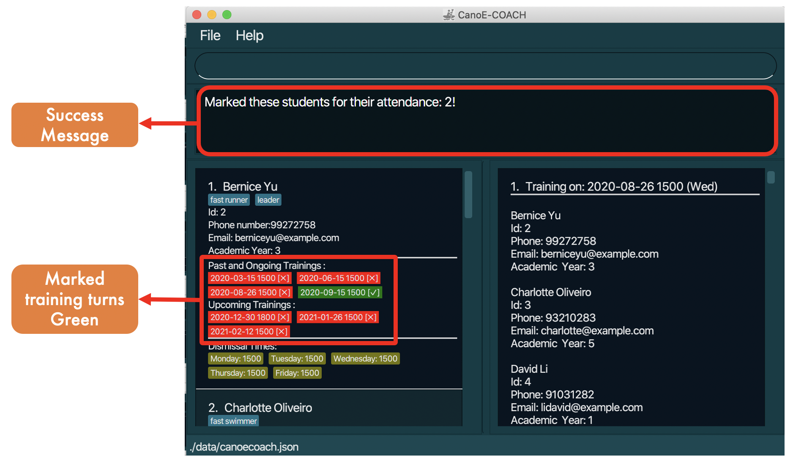

Format: `mark-attendance TRAINING_INDEX id/STUDENT_ID...`
* You will only be able to mark/unmark the attendance of a training that has already passed.
* Training index refers to the index of the training in the **displayed** training list.
* Only ONE training index can be specified in the same command.
* Multiple student ids can be specified in the same command.
* If the student's attendance has already been marked, `mark-attendance` would still execute successfully, but there will be no changes reflected. The converse is true as well for `unmark-attendance`.
* Student card will reflect the specified attendance as marked (tick) should the `mark-attendance` command be successfully executed.
* Student card will reflect the specified attendance as unmarked (cross) should the `unmark-attendance` command be successfully executed.

Format: `mark-attendance TRAINING_INDEX id/STUDENT_ID...`, `unmark-attendance TRAINING_INDEX id/STUDENT_ID...`

Examples:
- `mark-attendance 2 id/1,4,7` will indicate that students with unique ids of 1, 4 and 7 have their attendance associated with training session 2 marked.
- `unmark-attendance 2 id/1,4,7` will indicate that students with unique ids of 1, 4 and 7 have their attendance associated with training session 2 unmarked.

### Find all students with a bad attendance record: `find-bad-students`
Finds all students that have missed more than 3 training sessions.

* No parameters required for this command.
* Displays a list of students that have missed more than 3 prior training sessions.

Format: `find-bad-students`

### Clearing all entries: `clear`
Clears the student and training list of all existing students and trainings.

Format: `clear`

> Note: Be careful, this deletes all data stored inside of the program, including student and training records. All sample data will be cleared too.

### Exiting the program: `exit`
Exits the program.

Format: `exit`

## FAQ

**Q**: When does a training get classified as "past"? 
**A**: A training will be classified as "past" once the time tagged to it (start time) has passed.

**Q**: How do I transfer my data to another Computer? 
**A**: Install the app in the other computer and overwrite the empty data file it creates with the file that contains the data of your previous CanoE-COACH home folder.

--------------------------------------------------------------------------------------------------------------------

## Command summary

Action | Format, Examples
--------|------------------
**Add** | `add n/NAME p/PHONE_NUMBER e/EMAIL ay/ACADEMIC_YEAR [t/TAG]… [d1/MONDAY] [d2/TUESDAY] [d3/WEDNESDAY] [d4/THURSDAY] [d5/FRIDAY]​`   e.g., `add n/James Ho p/22224444 e/jamesho@example.com ay/1 t/friend`
**Clear** | `clear`
**Delete** | `delete STUDENT_INDEX`  e.g., `delete 3`
**Edit** | `edit STUDENT_INDEX [n/NAME] [p/PHONE_NUMBER] [e/EMAIL] [t/TAG]… [d1/MONDAY] [d2/TUESDAY] [d3/WEDNESDAY] [d4/THURSDAY] [d5/FRIDAY] ​`  e.g.,`edit 2 n/James Lee e/jameslee@example.com`
**Find** | `find [n/KEYWORDS] [p/PHONE_NUMBER] [ay/ACADEMIC_YEAR] [e/EMAIL] [d1/HHmm d2/HHmm d3/HHmm d4/HHmm d5/HHmm] [id/ID]`  e.g., `find n/James Jake ay/2`
**common-time** | `common-time [n/KEYWORDS] [ay/ACADEMIC_YEAR]`  e.g., `common-time n/alex ay/1`
**training** | `training yyyy-MM-dd HHmm`  e.g., `training 2021-01-20 1800`
**delete-training** | `delete-training TRAINING_INDEX`  e.g., `delete-training 1`
**ts-add** | `ts-add TRAINING_INDEX id/STUDENT_ID...`  e.g., `ts-add 1 id/1,2,3`
**ts-addall** | `ts-addall TRAINING_INDEX`  e.g., `ts-addall 1`
**ts-delete** | `ts-delete TRAINING_INDEX id/STUDENT_ID...`  e.g., `ts-delete 1 id/1,2,3`
**find-training** | `find-training [id/STUDENT_ID] [dt/DATETIME]`  e.g., `find-training id/1`
**mark-attendance** | `mark-attendance TRAINING_INDEX id/STUDENT_ID...`  e.g., `mark-attendance 2 id/1,4,7`
**unmark-attendance** | `unmark-attendance TRAINING_INDEX id/STUDENT_ID...`  e.g., `unmark-attendance 2 id/1,4,7`
**find-bad-students** | `find-bad-students`
**List** | `list`
**Help** | `help`

--------------------------------------------------------------------------------------------------------------------

## Glossary

* Dismissal Time: The time when a student is dismissed from his classes. He would be able to attend training only on or after his dismissal time.

* Training: A training session organised by the coach (the user), and attended by the students.

* Available Student: A student who is available to attend the training. A student is available to attend a training if his dismissal time is equal to or before training start time, and if he is not already attending a training on the same day.

* Attendance: Indicates the training session that a particular student is going to attend.

* "Mark" Attendance: A marked attendance indicates that a particular student had attended the training session, and it is only possible to mark attendance for a training that has already passed. A marked attendance can be unmarked to indicate absence / yet to attend.

* "Bad" student: A bad student is a student who has more than 3 unmarked attendances for trainings that have already passed.  (However, this is only in the context of this application. In the real world, even if you do miss many trainings, you could be a perfectly fine and good student.)

